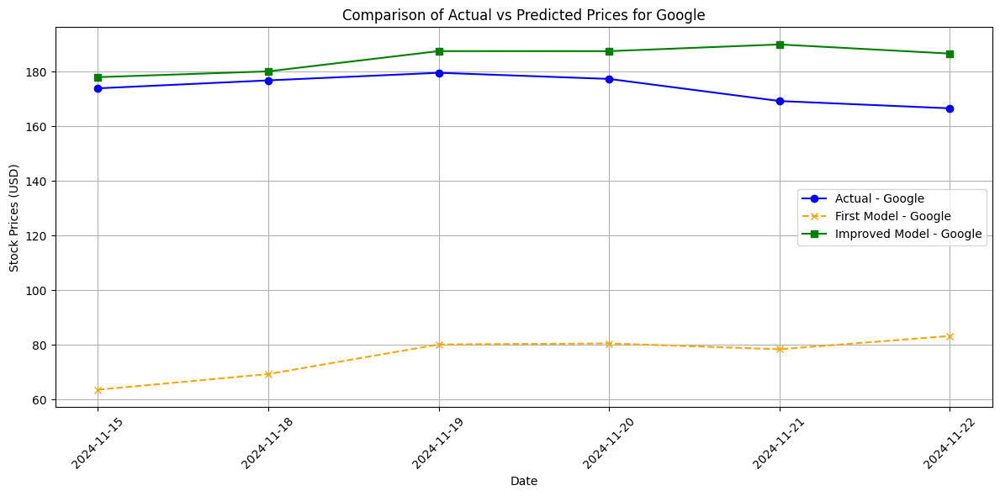
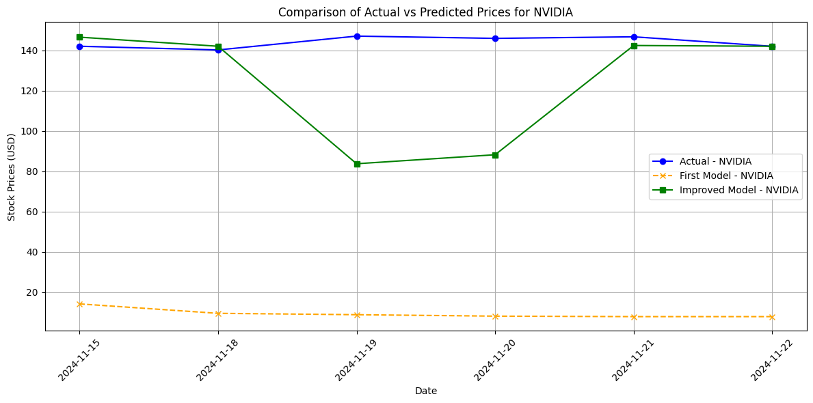
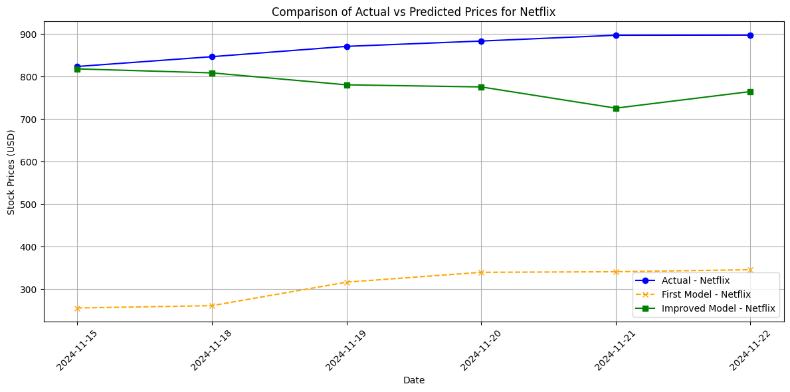
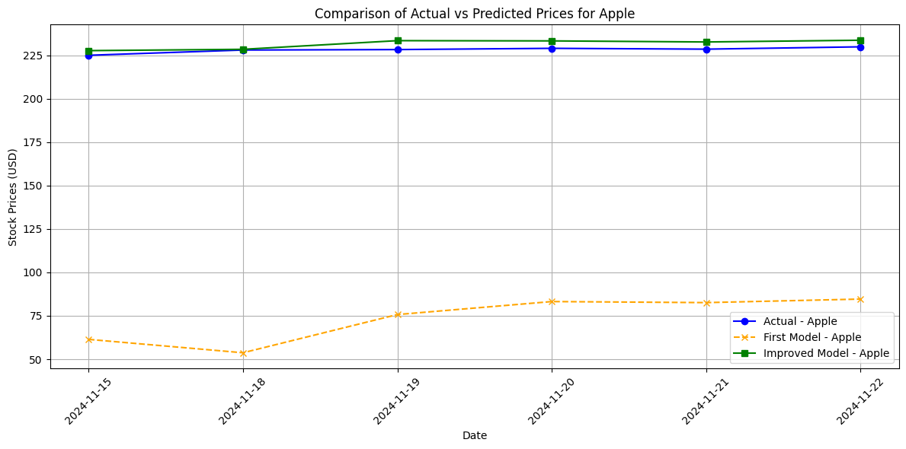

# Stock Price Prediction with Machine Learning and GDELT Integration

## Overview
This project focuses on building machine learning models to predict stock prices by integrating financial data with sentiment analysis metrics from GDELT (Global Database of Events, Language, and Tone). The models were tested on companies such as GOOGLE, NETFLIX, NVIDIA, and APPLE, with the aim of improving prediction accuracy through innovative data processing and model development.

Key highlights include:
- **Integration of GDELT sentiment data** with Yahoo Finance stock prices.
- Use of **XGBoost** and **LSTM** for time-series forecasting.
- Incorporation of advanced feature engineering techniques, including lag features and rolling averages.
- Evaluation of multiple models, including **transformer-based approaches** for future scalability.
- Explorations into future directions, such as **transformers** and **reinforcement learning**.

---

## Features
### Implemented Models
1. **First Model**:
   - Framework: XGBoost
   - Mean Absolute Errors (MAE):
     - GOOGLE: 32.13
     - NETFLIX: 149.58
     - NVIDIA: 14.09
     - APPLE: 49.94
   - Challenges:
     - Limited feature engineering.
     - Suboptimal hyperparameter tuning led to higher errors, especially for volatile stocks like NVIDIA.

2. **Improved Model**:
  - Framework: XGBoost with advanced feature engineering (e.g., lag features, rolling averages).
  - Performance
    - MAE:
      - GOOGLE: 0.113
      - NETFLIX: 0.559
      - NVIDIA: 0.074
      - APPLE: 0.135
  - Improvements:
    - Sector-specific insights were added.
    - Hyperparameters were fine-tuned using GridSearchCV.
    - Better handling of volatility in stocks like NVIDIA.

3. **LSTM Model:**
  - Framework: Sequential Neural Network (LSTM).
  - Performance:
    - Achieved MAE: 0.0201 (on AvgTone predictions).
  - Highlights:
    - Used time-series data and lagged features for sequential modeling.
    - Scaled input data for better gradient flow during training.

4. **GridSearch Optimized Model:**
  - Framework: XGBoost with hyperparameter tuning using GridSearchCV.
  - Achieved Best MAE:
    - GOOGLE: 3.73
    - NETFLIX: 8.97
    - NVIDIA: 0.78
    - APPLE: 2.79
  - Focused on exploring deeper tree architectures and enhanced learning rates.

---

## Data Sources
- **Historical Stock Prices**:
  - Acquired from Yahoo Finance.
  - Data covers a period from 2010-01-01 to 2024-11-15.
- **GDELT Sentiment Analysis**:
  - Data Attributes:
    - AvgTone: Sentiment polarity score.
  - Extracted using Google BigQuery from GDELT v2, focusing on AvgTone and sentiment metrics for stock-specific tone analysis.
- **Additional Features:**
  - Lagged stock prices (```Lag_1```, ```Lag_2```).
  - Rolling mean features (e.g., 5-day, 20-day averages).

---

## Visualizations

### 1. Residual Distributions and Over Time
   - Show the accuracy and variance of the combined models.
   - Key takeaway: Improved models have tighter residual distributions.

### 2. Actual vs Predicted Prices
- **GOOGLE**
    - Improved model predictions closely align with actual stock prices, reducing errors compared to the first model.
    

- **NVIDIA**
    - NVIDIA's high volatility posed challenges for the first model, which were addressed in the improved version.
    

- **NETFLIX**
    - For Netflix, the improved model effectively captures trends while addressing sentiment-driven deviations.
    

- **APPLE**
    - Apple's stock price predictions show high accuracy in both the first and improved models.
    

### 3. Sector-Specific Forecasts
   - Future predictions demonstrate scalability of improved models.

---

## Real Stock Prices Comparison
| Ticker | Date       | Actual Price | Improved Model | First Model |
|--------|------------|--------------|----------------|-------------|
| AAPL   | 2024-11-22 | $229.87      | $233.66        | $84.62      |
| GOOG   | 2024-11-22 | $166.57      | $170.99        | $83.23      |
| NFLX   | 2024-11-22 | $897.79      | $764.94        | $345.55     |
| NVDA   | 2024-11-22 | $141.94      | $141.86        | $7.83       |

---


## **Requirements**
- Python 3.10 or later
- Google Colab Pro for A100 GPU access (optional for large models)
    ``` bash
    pip install pandas numpy xgboost matplotlib keras tensorflow
     ```

## **Acknowledgements**

**Google BigQuery**: Extracted GDELT sentiment data for training.
**Google Colab Pro**: Providing access to A100 GPUs for experimentation.
**GDELTv2 Project**: For sentiment and tone data.
**Yahoo Finance**: Source for historical stock data.

## **Future Work**
1. **Improved Data Integration**:
Use Bloomberg Terminals for sector-wide data at $25,000/year.
Broaden sentiment analysis to include Reddit (e.g., WallStreetBets).
2. **Advanced Models**:
Incorporate Temporal Fusion Transformers (TFT) for better time-series forecasting.
Train models on NVIDIA A100 GPUs or Google TPUs ($1,000/month per TPU).
3. **Live Updates**:
Use GDELT live updates to adapt to evolving market trends.
Develop pipelines for continuous model retraining.
4. **Reinforcement Learning**:
Implement Stable-Baselines3 for dynamic trading strategies.
Define multi-objective reward functions to balance risk and return.


## **License**

This project is licensed under the MIT License. See the ```LICENSE``` file for more information.

This format should work perfectly for your project. Let me know if anything needs refinement!
